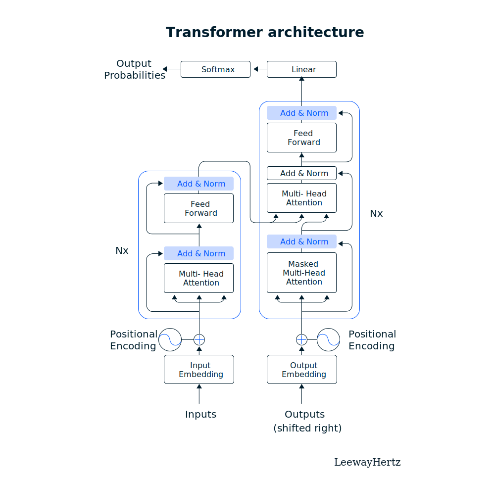

# How to build a GPT model?

Introduced by OpenAI, powerful Generative Pre-trained Transformer (GPT) language models have opened up new frontiers in Natural Language Processing (NLP). The integration of GPT models into virtual assistants and chatbots boosts their capabilities, which has resulted in a surge in demand for GPT models. According to a report published by Allied Market Research, titled “Global NLP Market,” the global NLP market size was valued at $11.1 billion in 2020 and is estimated to reach $341.5 billion by 2030, growing at a CAGR of 40.9% from 2021 to 2030. Interestingly, the demand for GPT models are a major contributor to this growth.

GPT models are a collection of deep learning-based language models created by the OpenAI team. Without supervision, these models can perform various NLP tasks like question-answering, textual entailment, text summarization, etc. These language models require very few or no examples to understand tasks. They perform equivalent to or even better than state-of-the-art models trained in a supervised fashion.

The most trained GPT model -GPT-3, has 175 billion learning parameters, making it ten times more powerful than any language model. It has the edge over other models in that it can perform tasks without extensive tuning; it only requires little textual-interactional demonstration, and the model does the rest. An advanced trained GPT model can make life easier by performing language translation, text summarization, question answering, chatbot integration, content generation, sentiment analysis, named entity recognition, text classification, text completion, text-to-speech synthesis and much more.

This article deeply delves into all aspects of GPT models and discusses the steps required to build a GPT model from scratch.

* What is a GPT model?
* Working mechanism of GPT models
* Prerequisites to build a GPT model
* How to create a GPT model? – Steps for building a GPT model
* Things to consider while building a GPT model

# What is a GPT model?
GPT stands for Generative Pre-trained Transformer, the first generalized language model in NLP. Previously, language models were only designed for single tasks like text generation, summarization or classification. GPT is the first generalized language model ever created in the history of natural language processing that can be used for various NLP tasks. Now let us explore the three components of GPT, namely Generative, Pre-Trained, and Transformer and understand what they mean.

* **Generative**: Generative models are statistical models used to generate new data. These models can learn the relationships between variables in a data set to generate new data points similar to those in the original data set.
* **Pre-trained**: These models have been pre-trained using a large data set which can be used when it is difficult to train a new model. Although a pre-trained model might not be perfect, it can save time and improve performance.
* **Transformer**: The transformer model, an artificial neural network created in 2017, is the most well-known deep learning model capable of handling sequential data such as text. Many tasks like machine translation and text classification are performed using transformer models.

GPT can perform various NLP tasks with high accuracy depending on the large datasets it was trained on and its architecture of billion parameters, allowing it to understand the logical connections within the data. GPT models, like the latest version GPT-3, have been pre-trained using text from five large datasets, including Common Crawl and WebText2. The corpus contains nearly a trillion words, allowing GPT-3 to perform NLP tasks quickly and without any examples of data.

# Working mechanism of GPT models
GPT is an AI language model based on transformer architecture that is pre-trained, generative, unsupervised, and capable of performing well in zero/one/few-shot multitask settings. It predicts the next token (an instance of a sequence of characters) from a sequence of tokens for NLP tasks, it has not been trained on. After seeing only a few examples, it can achieve the desired outcomes in certain benchmarks, including machine translation, Q&A and cloze tasks. GPT models calculate the likelihood of a word appearing in a text given that it appears in another text primarily based on conditional probability. For example, in the sentence, “Margaret is organizing a garage sale…Perhaps we could purchase that old…” the word chair is more likely appropriate than the word ‘elephant’. Also, transformer models use multiple units called attention blocks that learn which parts of a text sequence to be focused on. One transformer might have multiple attention blocks, each learning different aspects of a language.

<p align="center">Transformer Architecture</p>



A transformer architecture has two main segments: an encoder that primarily operates on the input sequence and a decoder that operates on the target sequence during training and predicts the next item. For example, a transformer might take a sequence of English words and predict the French word in the correct translation until it is complete.

The encoder determines which parts of the input should be emphasized. For example, the encoder can read a sentence like “The quick brown fox jumped.” It then calculates the embedding matrix (embedding in NLP allows words with similar meanings to have a similar representation) and converts it into a series of attention vectors. Now, what is an attention vector? You can view an attention vector in a transformer model as a special calculator, which helps the model understand which parts of any given information are most important in making a decision. Suppose you have been asked multiple questions in an exam that you must answer using different information pieces. The attention vector helps you to pick the most important information to answer each question. It works in the same way in the case of a transformer model.

The multi-head attention block initially produces these attention vectors. They are then normalized and passed into a fully connected layer. Normalization is again done before being passed to the decoder. During training, the encoder works directly on the target output sequence. Let us say that the target output is the French translation of the English sentence “The quick brown fox jumped.” The decoder computes separate embedding vectors for each French word of the sentence. Additionally, the positional encoder is applied in the form of sine and cosine functions. Also, masked attention is used, which means that the first word of the French sentence is used, whereas all other words are masked. This allows the transformer to learn to predict the next French words. These outputs are then added and normalized before being passed on to another attention block which also receives the attention vectors generated by the encoder.

Alongside, GPT models employ some data compression while consuming millions upon millions of sample texts to convert words into vectors which are nothing but numerical representations. The language model then unpacks the compressed text into human-friendly sentences. The model’s accuracy is improved by compressing and decompressing text. This also allows it to calculate the conditional probability of each word. GPT models can perform well in “few shots” settings and respond to text samples that have been seen before. They only require a few examples to produce pertinent responses because they have been trained on many text samples.

Besides, GPT models have many capabilities, such as generating unprecedented-quality synthetic text samples. If you prime the model with an input, it will generate a long continuation. GPT models outperform other language models trained on domains such as Wikipedia, news, and books without using domain-specific training data. GPT learns language tasks such as reading comprehension, summarization and question answering from the text alone, without task-specific training data. These tasks’ scores (“score” refers to a numerical value the model assigns to represent the likelihood or probability of a given output or result) are not the best, but they suggest unsupervised techniques with sufficient data and computation that could benefit the tasks.

# How to create a GPT model? A step-by-step guide
In this section, with code snippets, we will show steps to build a GPT (Generative Pre-trained Transformer) model using the PyTorch library. The code is organized into several sections performing the following tasks sequentially:

* **Data preprocessing**: The first section of the code preprocesses the input text data by tokenizing it into a list of words, encoding each word into a unique integer, and generating sequences of fixed length using a sliding window approach.
* **Model configuration**: This section of the code defines the configuration parameters for the GPT model, including the number of transformer layers, the number of attention heads, the size of the hidden layers, and the size of the vocabulary.
* **Model architecture**: This section of the code defines the architecture of the GPT model using PyTorch modules. The model consists of an embedding layer, followed by a stack of transformer layers, and a linear layer that outputs the probability distribution over the vocabulary for the next word in the sequence.
* **Training loop**: This section of the code defines the training loop for the GPT model. It uses the Adam optimizer to minimize the cross-entropy loss between the sequence’s predicted and actual next words. The model is trained on batches of data generated from the preprocessed text data.
* **Text generation**: The final section of the code demonstrates how to use the trained GPT model to generate new text. It initializes the context with a given seed sequence and iteratively generates new words by sampling from the probability distribution output by the model for the next word in the sequence. The generated text is decoded back into words and printed to the console.

## Importing libraries
The first step is to import the necessary libraries for building a neural network using PyTorch, which includes importing the necessary modules and functions.

```
import torch
import torch.nn as nn
from torch.nn import functional as F
```

In this code snippet, we are importing the PyTorch library, which is a popular deep-learning framework used for building neural networks. The developer then imports the nn module from the torch library which contains classes and functions for defining and training neural networks.

## Defining hyperparameters
The next step is to define various hyperparameters for building a GPT model. These hyperparameters are essential for training and fine-tuning the GPT model. These hyperparameters will determine the model’s performance, speed, and capacity, and the developer can experiment with different values to optimize the model’s behavior.

```
# hyperparameters
batch_size = 16 # how many independent sequences will we process in parallel?
block_size = 32 # what is the maximum context length for predictions?
max_iters = 5000
eval_interval = 100
learning_rate = 1e-3
device = 'cuda' if torch.cuda.is_available() else 'cpu'
eval_iters = 200
n_embd = 64
n_head = 4
n_layer = 4
dropout = 0.0
```

The hyperparameters defined in this code snippet are:

* **batch_size**: This parameter determines the number of independent sequences that will be processed in parallel during training. A larger batch size can speed up training, but it requires more memory.
* **block_size**: This parameter sets the maximum context length for predictions. The GPT model generates predictions based on the context it receives as input, and this parameter sets the maximum length of that context.
* **max_iters**: This parameter sets the maximum number of training iterations for the GPT model.
* **eval_interval**: This parameter sets the number of training iterations, after which the model’s performance will be evaluated.
* **learning_rate**: This parameter determines the learning rate for the optimizer during training.
* **device**: This parameter sets the device (CPU or GPU) on which the GPT model will be trained.
* **eval_iters**: This parameter sets the number of training iterations, after which the model’s performance will be evaluated and saved.
* **n_embd**: This parameter sets the number of embedding dimensions for the GPT model. The embedding layer maps the input sequence into a high-dimensional space, and this parameter determines the size of that space.
* **n_head**: This parameter sets the number of attention heads in the multi-head attention layer of the GPT model. The attention mechanism allows the model to focus on specific parts of the input sequence.
* **n_layer**: This parameter sets the number of layers in the GPT model.
* **dropout**: This parameter sets the dropout probability for the GPT model. Dropout is a regularization technique that randomly drops out some of the neural network’s nodes during training to prevent overfitting.
## Reading input file

```
torch.manual_seed(1337)
 
# wget https://github.com/dahan5/gpt/blob/646fca00911277c88ca2b36f304a676fea6e3e2b/input.txt
with open('input.txt', 'r', encoding='utf-8') as f:
    text = f.read()
```

In this code snippet, we are setting a manual seed for PyTorch’s random number generator using torch.manual_seed(). This is done to ensure that the results of the GPT model are reproducible. The argument passed to torch.manual_seed() is an arbitrary number (1337 in this case) that serves as the seed for the random number generator. By setting a fixed seed, the developer can ensure that the same sequence of random numbers is generated every time the code is run, which in turn ensures that the GPT model is trained and tested on the same data.

Next, we are reading in a text file using Python’s built-in open() function and reading its contents using the read() method. The text file contains the input text that will be used to train the GPT model. The text data can be preprocessed further, for instance, by cleaning the text, tokenizing it, and creating a vocabulary, depending on the requirements of the GPT model. Once the text data is preprocessed, it can be passed through the GPT model to generate predictions.

## Identifying unique characters that occur in a text

```
chars = sorted(list(set(text)))
vocab_size = len(chars)
```

In this code snippet, we are creating a vocabulary for the GPT model.

First, we create a sorted list of unique characters present in the text data using the set() function and list() constructor. The set() function returns a collection of unique elements from the text, and the list() constructor converts that set into a list. The sorted() function sorts the list alphabetically, creating a sorted list of unique characters present in the text.

Next, we are getting the length of the chars list using the len() function. This gives the number of unique characters in the text and serves as the vocabulary size for the GPT model.

The vocabulary size is an important hyperparameter that determines the capacity of the GPT model. The larger the vocabulary size, the more expressive the model can be, but it also increases the model’s complexity and training time. The vocabulary size is typically chosen based on the size of the input text and the nature of the problem being solved.

Once the vocabulary is created, the characters in the text data can be mapped to integer values and passed through the GPT model to generate predictions.

## Creating mapping
The first step is to create a mapping between characters and integers, which is necessary for building a language model such as GPT. For the model to work with text data, it needs to be able to represent each character as a numerical value, which is what the following code accomplishes.

```
create a mapping from characters to integers
stoi = { ch:i for i,ch in enumerate(chars) }
itos = { i:ch for i,ch in enumerate(chars) }
encode = lambda s: [stoi[c] for c in s] # encoder: take a string, output a list of integers
decode = lambda l: ''.join([itos[i] for i in l]) # decoder: take a list of integers, output a string
 
print(encode("hii there"))
print(decode(encode("hii there")))
```

This code block creates a character-to-integer mapping and its inverse (integer-to-character mapping) for a set of characters. The stoi dictionary maps each character to a unique integer while itos maps each integer back to its corresponding character. The encode function takes a string as input and returns a list of integers, where each integer corresponds to the index of the character in the chars set. The decode function takes a list of integers and returns the original string by looking up the corresponding characters in the itos dictionary. The code then tests the encoding and decoding functions by encoding the string “hii there” and then decoding the resulting list of integers back into a string.

## Encoding input data
In building a GPT model, it’s important to encode the entire text dataset so that it can be fed into the model. The following code does exactly that.

```
let's now encode the entire text dataset and store it into a torch.Tensor
import torch # we use PyTorch: https://pytorch.org
data = torch.tensor(encode(text), dtype=torch.long)
print(data.shape, data.dtype)
print(data[:1000]) # the 1000 characters we looked at earier will to the GPT look like this
```
 
This code imports the PyTorch library and creates a tensor called data. The tensor is filled with the encoded text data, which is obtained by calling the encode function on the text variable. The dtype parameter is set to torch.long to ensure that the tensor elements are integers. The code prints the shape and data type of the data tensor. The shape attribute tells us the size of the tensor along each dimension, while the dtype attribute tells us the data type of the tensor elements. This information is useful for verifying that the tensor has been created correctly and will be compatible with the GPT model. It then prints the first 1000 elements of the data tensor, which represent the encoded text data. This is useful for verifying that the encoding process has worked correctly and that the data has been loaded into the tensor as expected.

## Splitting up the data into train and validation sets
The following code is useful for understanding how the GPT model will process the input data. It shows how the model will process input sequences of length block_size, and how the input and output sequences are related to each other. This understanding can help in designing and training the GPT model.

```
# Let's now split up the data into train and validation sets
n = int(0.9*len(data)) # first 90% will be train, rest val
train_data = data[:n]
val_data = data[n:]
block_size = 8
train_data[:block_size+1]
x = train_data[:block_size]
y = train_data[1:block_size+1]
for t in range(block_size):
    context = x[:t+1]
    target = y[t]
    print(f"when input is {context} the target: {target}")
```

This code splits the encoded text data into training and validation sets. The first 90% of the data is assigned to the train_data variable, while the remaining 10% is assigned to the val_data variable. It defines the block_size variable to be 8, which determines the input sequence size that the GPT model will process at a time. It then selects a portion of the training data that is block_size+1 elements long and assigns it to train_data. The x variable is assigned the first block_size elements of train_data, while the y variable is assigned the next block_size elements of train_data, starting from the second element. In other words, y is shifted one position relative to x. Next, the code loops over the block_size elements of x and y, and prints out the input context and target for each position in the input sequence. For each iteration of the loop, the context variable is set to the first t+1 elements of x, where t ranges from 0 to block_size-1. The target variable is set to the t-th element of y. The loop then prints out a message indicating the current input context and target.

## Generating batches of input and target data for training the GPT

```
torch.manual_seed(1337)
batch_size = 4 # how many independent sequences will we process in parallel?
block_size = 8 # what is the maximum context length for predictions?
 
def get_batch(split):
    # generate a small batch of data of inputs x and targets y
    data = train_data if split == 'train' else val_data
    ix = torch.randint(len(data) - block_size, (batch_size,))
    x = torch.stack([data[i:i+block_size] for i in ix])
    y = torch.stack([data[i+1:i+block_size+1] for i in ix])
    return x, y
 
xb, yb = get_batch('train')
print('inputs:')
print(xb.shape)
print(xb)
print('targets:')
print(yb.shape)
print(yb)
 
print('----')
 
for b in range(batch_size): # batch dimension
    for t in range(block_size): # time dimension
        context = xb[b, :t+1]
        target = yb[b,t]
        print(f"when input is {context.tolist()} the target: {target}")
```

This code sets the random seed of PyTorch to 1337, which ensures that the random number generation is deterministic and reproducible. This is important for training the GPT model and getting consistent results. It defines the batch_size and block_size variables. batch_size specifies how many independent sequences will be processed in parallel in each batch, while block_size specifies the maximum context length for predictions. Then it defines a function called get_batch that generates a small batch of data of inputs x and targets y for a given split (either train or val). The function first selects the appropriate dataset (train_data or val_data) based on the input split. It then randomly selects batch_size starting positions for x using torch.randint(), ensuring that each starting position is at least block_size positions away from the end of the dataset to avoid going out of bounds. It then constructs x and y tensors by selecting block_size elements starting from each starting position, with y shifted one position to the right relative to x. The function returns the x and y tensors as a tuple. It calls the get_batch() function with the argument ‘train’ to generate a batch of training data. It then prints the shape and contents of the x and y tensors. Finally, it loops over each element in the batch (dimension batch_size) and each position in the input sequence (dimension block_size), and prints out the sequence’s input context and target for each position. The context variable is set to the first t+1 elements of xb[b,:], where t ranges from 0 to block_size-1. The target variable is set to the t-th element of yb[b,:]. The loop then prints out a message indicating the current input context and target.

## Calculating the average loss on the training and validation datasets using a pre-trained model

```
@torch.no_grad()
def estimate_loss():
    out = {}
    model.eval()
    for split in ['train', 'val']:
        losses = torch.zeros(eval_iters)
        for k in range(eval_iters):
            X, Y = get_batch(split)
            logits, loss = model(X, Y)
            losses[k] = loss.item()
        out[split] = losses.mean()
    model.train()
    return out
```

This code defines a function estimate_loss() which calculates the average loss on the training and validation datasets using a pre-trained model. It uses the @torch.no_grad() decorator to disable gradient computation during the evaluation, and sets the model to evaluation mode using model.eval(). Then, it iterates over the training and validation datasets eval_iters times, computes the logits and loss for each batch using the pre-trained model, and records the losses. Finally, it returns the average losses for the two datasets and sets the model back to training mode using model.train(). This function is useful for monitoring the model’s performance during training and determining when to stop training.

## Defining one head of the self-attention mechanism in a transformer model

```
class Head(nn.Module):
    """ one head of self-attention """
 
    def __init__(self, head_size):
        super().__init__()
        self.key = nn.Linear(n_embd, head_size, bias=False)
        self.query = nn.Linear(n_embd, head_size, bias=False)
        self.value = nn.Linear(n_embd, head_size, bias=False)
        self.register_buffer('tril', torch.tril(torch.ones(block_size, block_size)))
 
        self.dropout = nn.Dropout(dropout)
 
    def forward(self, x):
        B,T,C = x.shape
        k = self.key(x)   # (B,T,C)
        q = self.query(x) # (B,T,C)
        # compute attention scores ("affinities")
        wei = q @ k.transpose(-2,-1) * C**-0.5 # (B, T, C) @ (B, C, T) -> (B, T, T)
        wei = wei.masked_fill(self.tril[:T, :T] == 0, float('-inf')) # (B, T, T)
        wei = F.softmax(wei, dim=-1) # (B, T, T)
        wei = self.dropout(wei)
        # perform the weighted aggregation of the values
        v = self.value(x) # (B,T,C)
        out = wei @ v # (B, T, T) @ (B, T, C) -> (B, T, C)
        return out
```

This code defines a module called Head which represents one head of the self-attention mechanism used in the GPT model. The __init__ method initializes three linear layers (key, query, and value) that will be used to project the input tensor x into a lower-dimensional space, which helps compute the attention scores efficiently. The forward method takes as input a tensor x of shape (batch_size, sequence_length, embedding_size) and computes the self-attention scores using the dot-product attention mechanism. The attention scores are computed by taking the dot product of the query and key projections and normalizing the result by the square root of the embedding size. The resulting attention scores are then masked with a triangular matrix to prevent attending to future tokens. The attention scores are then normalized with a softmax function, multiplied by the value projection, and finally aggregated to produce the output tensor of shape (batch_size, sequence_length, embedding_size). The dropout layer is applied to the attention scores before the final aggregation.

## Implementing the multi-head attention mechanism

```
class MultiHeadAttention(nn.Module):
    """ multiple heads of self-attention in parallel """
 
    def __init__(self, num_heads, head_size):
        super().__init__()
        self.heads = nn.ModuleList([Head(head_size) for _ in range(num_heads)])
        self.proj = nn.Linear(n_embd, n_embd)
        self.dropout = nn.Dropout(dropout)
 
    def forward(self, x):
        out = torch.cat([h(x) for h in self.heads], dim=-1)
        out = self.dropout(self.proj(out))
        return out
```

This PyTorch module implements the multi-head attention mechanism used in building GPT models. It contains a number of heads, each of which computes a self-attention matrix for the input sequence. The output of each head is concatenated and projected to the original embedding size using a linear layer and then passed through a dropout layer. The result is a new sequence of the same length but with a larger embedding dimension that encodes information from multiple self-attention heads. This module is used as a building block in the GPT model.

## Model training and text generation

```
class BigramLanguageModel(nn.Module):
 
    def __init__(self):
        super().__init__()
        # each token directly reads off the logits for the next token from a lookup table
        self.token_embedding_table = nn.Embedding(vocab_size, n_embd)
        self.position_embedding_table = nn.Embedding(block_size, n_embd)
        self.blocks = nn.Sequential(*[Block(n_embd, n_head=n_head) for _ in range(n_layer)])
        self.ln_f = nn.LayerNorm(n_embd) # final layer norm
        self.lm_head = nn.Linear(n_embd, vocab_size)
 
    def forward(self, idx, targets=None):
        B, T = idx.shape
 
        # idx and targets are both (B,T) tensor of integers
        tok_emb = self.token_embedding_table(idx) # (B,T,C)
        pos_emb = self.position_embedding_table(torch.arange(T, device=device)) # (T,C)
        x = tok_emb + pos_emb # (B,T,C)
        x = self.blocks(x) # (B,T,C)
        x = self.ln_f(x) # (B,T,C)
        logits = self.lm_head(x) # (B,T,vocab_size)
 
        if targets is None:
            loss = None
        else:
            B, T, C = logits.shape
            logits = logits.view(B*T, C)
            targets = targets.view(B*T)
            loss = F.cross_entropy(logits, targets)
 
        return logits, loss
 
    def generate(self, idx, max_new_tokens):
        # idx is (B, T) array of indices in the current context
        for _ in range(max_new_tokens):
            # crop idx to the last block_size tokens
            idx_cond = idx[:, -block_size:]
            # get the predictions
            logits, loss = self(idx_cond)
            # focus only on the last time step
            logits = logits[:, -1, :] # becomes (B, C)
            # apply softmax to get probabilities
            probs = F.softmax(logits, dim=-1) # (B, C)
            # sample from the distribution
            idx_next = torch.multinomial(probs, num_samples=1) # (B, 1)
            # append sampled index to the running sequence
            idx = torch.cat((idx, idx_next), dim=1) # (B, T+1)
        return idx
 
model = BigramLanguageModel()
m = model.to(device)
# print the number of parameters in the model
print(sum(p.numel() for p in m.parameters())/1e6, 'M parameters')
 
# create a PyTorch optimizer
optimizer = torch.optim.AdamW(model.parameters(), lr=learning_rate)
 
for iter in range(max_iters):
 
    # every once in a while evaluate the loss on train and val sets
    if iter % eval_interval == 0 or iter == max_iters - 1:
        losses = estimate_loss()
        print(f"step {iter}: train loss {losses['train']:.4f}, val loss {losses['val']:.4f}")
 
    # sample a batch of data
    xb, yb = get_batch('train')
 
    # evaluate the loss
    logits, loss = model(xb, yb)
    optimizer.zero_grad(set_to_none=True)
    loss.backward()
    optimizer.step()
 
# generate from the model
context = torch.zeros((1, 1), dtype=torch.long, device=device)
print(decode(m.generate(context, max_new_tokens=2000)[0].tolist()))
```

This code defines a bigram language model using PyTorch to train a GPT model.

The BigramLanguageModel class is defined as a subclass of nn.Module and contains several layers that are used to build the model. The __init__ method initializes the model with an embedding layer for the tokens and a separate embedding layer for the position of the tokens. Additionally, the model has a sequence of transformer blocks, which are defined by the Block function, and a final layer norm and linear layer to output the logits of the next token. The forward method takes in input sequences and targets, computes the embeddings, applies the transformer blocks, and outputs the logits of the next token along with the loss if targets are provided.

The generate method is used to generate new sequences of text from the model. It takes in a starting sequence and a maximum number of new tokens to generate. The method iteratively samples the next token from the model’s predicted probability distribution and appends it to the running sequence until the desired length is reached.

In the main part of the code, an instance of the BigramLanguageModel class is created and moved to a specified device. The PyTorch AdamW optimizer is then created, and the training loop begins. In each iteration, a batch of data is sampled from the training set using the get_batch function. The model is then evaluated on this batch of data, the loss is computed, and the gradients are backpropagated using loss.backward(). Finally, the optimizer’s step() method is called to update the model’s parameters.

After training, the generate method is used to generate a sequence of text from the trained model. A context tensor of zeros is created, and the generate method is called with this context and a maximum number of new tokens to generate. The resulting sequence of tokens is decoded using the decode function to produce a string of generated text.

## Things to consider while building a GPT model
### Removing bias and toxicity
As we strive to build powerful generative AI models, we must be aware of the tremendous responsibility that comes with it. It is crucial to acknowledge that models such as GPT are trained on vast and unpredictable data from the internet, which can lead to biases and toxic language in the final product. As AI technology evolves, responsible practices become increasingly important. We must ensure that our AI models are developed and deployed ethically and with social responsibility in mind. Prioritizing responsible AI practices is vital in reducing the risks of biased and toxic content while fully unlocking the potential of generative AI to create a better world.

It is necessary to take a proactive approach to ensure that the output generated by AI models is free from bias and toxicity. This includes filtering training datasets to eliminate potentially harmful content and implementing watchdog models to monitor output in real-time. Furthermore, leveraging first-party data to train and fine-tune AI models can significantly enhance their quality. This allows customization to meet specific use cases, improving overall performance.

### Improving hallucination
It is essential to acknowledge that while GPT models can generate convincing arguments, they may not always be based on factual accuracy. Within the developer community, this issue is known as “hallucination,” which can reduce the reliability of the output produced by these AI models. To overcome this challenge, you need to consider the measures as taken by OpenAI and other vendors, including data augmentation, adversarial training, improved model architectures, and human evaluation to enhance the accuracy of the output and decrease the risk of hallucination and ensure output generated by the model is as precise and dependable as possible.

### Preventing data leakage
Establishing transparent policies is crucial to prevent developers from passing sensitive information into GPT models, which could be incorporated into the model and resurfaced in a public context. By implementing such policies, we can prevent the unintentional disclosure of sensitive information, safeguard the privacy and security of individuals and organizations, and avoid any negative consequences. This is essential to remain vigilant in safeguarding against potential risks associated with the use of GPT models and take proactive measures to mitigate them.

### Incorporating queries and actions
Current generative models can provide answers based on their initial large training data set or smaller “fine-tuning” data sets, which are not real-time and historical. However, the next generation of models will take a significant leap forward. These models will possess the capability to identify when to seek information from external sources such as a database or Google or trigger actions in external systems, transforming generative models from isolated oracles to fully connected conversational interfaces with the world. By enabling this new level of connectivity, we can unlock a new set of use cases and possibilities for these models, creating a more dynamic and seamless user experience that provides real-time, relevant information and insights.

## Endnote
GPT models are a significant milestone in the history of AI development, which is a part of a larger LLM trend that will grow in the future. Furthermore, OpenAI’s groundbreaking move to provide API access is part of its model-as-a-service business scheme. Additionally, GPT’s language-based capabilities allow for creating innovative products as it excels at tasks such as text summarization, classification, and interaction. GPT models are expected to shape the future internet and how we use technology and software. Building a GPT model may be challenging, but with the right approach and tools, it becomes a rewarding experience that opens up new opportunities for NLP applications.
